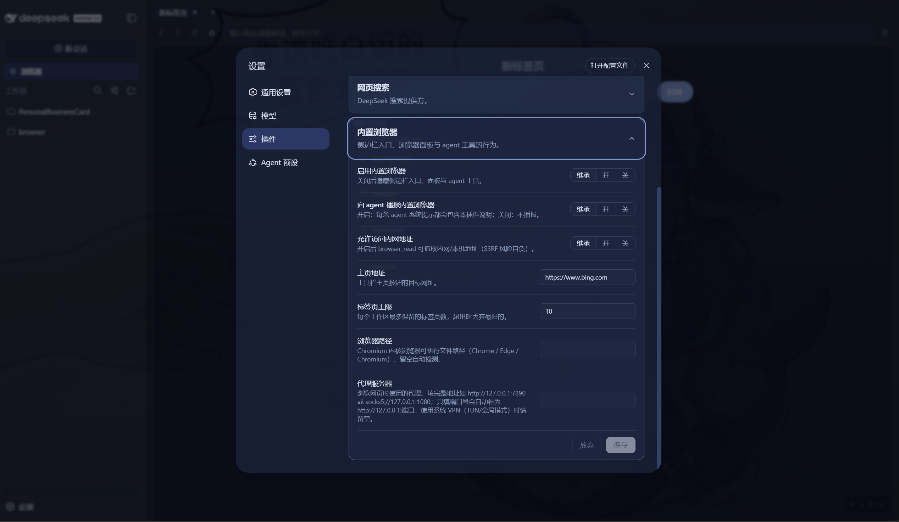
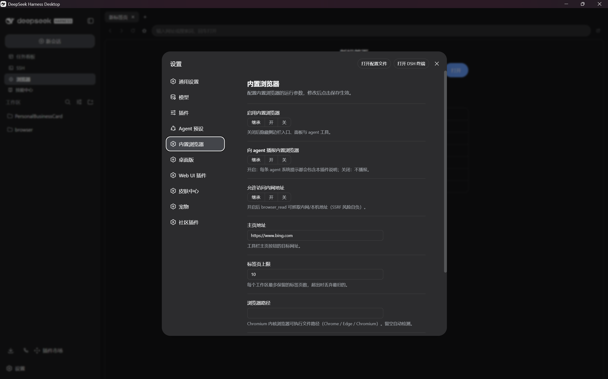

# DSH 内置浏览器

[English](README.md) | 中文

> DSH Web GUI 的内置浏览器：在聊天界面里浏览网页与工作区文件——多标签、地址栏、
> 标签页按工作区持久化——并提供 agent 工具（`browser_open`、`browser_read`）。
> 页面由宿主端的无头 Chromium（Puppeteer）渲染，因此发送 `X-Frame-Options`
> 的站点也能正常加载。

DeepSeek Harness（DSH）的外部插件包，单包双半区 cordis bundle：host 半区拥有
agent 工具、`/api/dsh-browser` 路由族（Puppeteer 页面代理 + SSE 打开事件流 +
工作区文件列表/读取）、设置命名空间与系统提示词公告；browser 半区渲染侧边栏
入口、多标签面板与插件设置卡。热插拔挂载——
`dsh plugin --profile <name> add link:<repo>`。

> **平台支持**：同时兼容 DSH Web 版与 Desktop 版。核心功能无需改动 DSH。
> Web 端的可视化设置卡位于「设置 → 插件」，需要一次性源码补丁（方案 A），
> 或改用配置文件（方案 B）；Desktop 版设置页为左侧独立菜单项，无需修改源码。

## 前置要求

宿主机器必须安装基于 Chromium 的浏览器（Chrome、Edge 或 Chromium）。插件在
Windows、macOS、Linux 上自动检测可执行文件路径，也可在设置卡中手动指定。
插件使用 `puppeteer-core`（而非 `puppeteer`），不会自行下载 Chromium。

## 功能

- **入口**：侧边栏「浏览器」一行，位于新建会话按钮下方。
- **面板**：接管中心列，包含标签栏、工具栏（后退 / 前进 / 刷新 / 主页 /
  在系统浏览器中打开）、地址栏（网址或搜索词，回车打开）与 iframe 内容区。
  每个页面由宿主端共享的无头 Chromium 渲染——代理路由等待 `networkidle`，
  读取完整执行后的 DOM，注入 `<base>` 与链接拦截脚本，再返回给 iframe。
  非活动标签保持挂载、状态不丢；iframe 首次激活时才加载，避免恢复大量标签
  时一次性发请求。
- **链接拦截**：代理页面内的 `http(s)` 链接点击会被捕获并通知面板——
  `target="_blank"` / `window.open` 新开标签，普通链接在当前标签导航。
  任何情况都不会弹出系统浏览器。
- **按工作区持久化**：标签集按项目根目录存入 localStorage（防抖写入 +
  页面隐藏时冲刷）。切换会话即切换整个标签集，切回自动恢复。可配置上限
  （默认 10），超出丢弃最旧的未激活标签。
- **工作区浏览**：新标签页列出当前工作区目录（文件夹可进入、面包屑导航、
  上一级按钮）；点击文件经宿主文件路由在面板中打开。HTML 预览注入 `<base>`
  使相对图片/样式可解析，并以 CSP `sandbox` 头保证被预览文件绝不能在 GUI
  源中执行脚本。
- **agent 工具**：`browser_open` 把网页推送到面板（新开标签并聚焦面板）；
  `browser_read` 由宿主抓取网页并返回可读正文文本（静态 HTML 近似提取，
  不执行 JS）。
- **设置卡**：Web 版在「设置 → 插件」区新增「内置浏览器」卡片；Desktop 版
  在左侧导航栏新增「内置浏览器」独立设置页。两者均支持暂存编辑、保存/放弃、
  继承/恢复默认语义。字段：启用开关、agent 播报、主页地址、标签上限、内网访问
  开关、浏览器可执行文件路径、代理服务器。
- **agent 公告**：系统提示词段落向每个 agent 说明本插件、工具与限制（与
  dsh-ssh 同一机制）。

## 安装

```sh
# 本地 checkout（开发模式）
dsh plugin --profile <name> add link:<repo>

# npm（发布后）
dsh plugin --profile <name> add @nono-neko/dsh-browser
```

重启 `dsh web` 后侧边栏出现入口。web profile 需具备 bundle 注入的
`@deepseek-ai/*` 客户端包（任何 rc.6 web 部署都自带）。请确保宿主机器已安装
基于 Chromium 的浏览器。

## 配置

插件设置采用分层解析：schema 默认值 → 插件 `cordis.yml` 入口配置（组合基
层）→ 用户设置文档。所有字段均可选。

| 字段 | 类型 | 默认值 | 说明 |
|---|---|---|---|
| `enabled` | boolean | `true` | 挂载侧边栏入口、工具与代理路由。 |
| `announceToAgent` | boolean | `true` | 注入 system-prompt 段落，告知 agent `browser_open` / `browser_read` 的存在。 |
| `defaultHome` | string | `https://www.bing.com` | 新标签页 / 主页按钮加载的 URL。 |
| `maxTabs` | number | `10` | 每个工作区的标签上限，超出后裁剪最久未激活的标签。 |
| `allowPrivateAccess` | boolean | `false` | 允许 `browser_read` 访问内网 / loopback 地址。 |
| `browserExecutable` | string | 自动检测 | Chromium 系浏览器（Chrome / Edge / Chromium）的绝对路径。 |
| `proxyServer` | string | 空 | 通过代理路由 Puppeteer 流量，例如 `http://127.0.0.1:7890`。 |

### 方案 A — 可视化设置卡（一次性 DSH 源码补丁）

插件在设置页提供可交互的设置表单：

- **Web 版**：**设置 → 插件 → 内置浏览器**，需要一次性 DSH 源码补丁（见下方）。核心功能无需补丁即可使用。
- **Desktop 版**：左侧导航栏 **内置浏览器**，无需修改源码，安装后立即可用

| Web 版设置卡 | Desktop 版设置页 |
|---|---|
|  |  |

> **Web 端的可视化设置卡需要一次性 DSH 源码补丁。** 截至 DSH rc.6，设置 API
> 只暴露 `packages/host/apiproxy/src/api-proxy.ts` 中硬编码白名单
> （`WEB_SETTINGS_NAMESPACES`）里的命名空间。外部插件的命名空间即使注册成
> 功也会被过滤，因此设置卡会显示「未暴露」，直到你把 `'dsh-browser'` 加进
> 该数组并重启 `dsh web`。此补丁仅用于启用可视化设置卡，核心功能（浏览、
> agent 工具等）无需补丁即可使用。DSH 团队已注明，把这个声明移到
> `settings.register()` 让插件自行暴露是待办工作。

在你的 DSH 源码中编辑 `packages/host/apiproxy/src/api-proxy.ts`：

```ts
const WEB_SETTINGS_NAMESPACES = [
  'agent-loop', 'shell', 'locale', 'permission', 'ui-conversation',
  'ui-theme', 'web-search-deepseek', 'dsh-browser',  // <-- 加这一行
] as const
```

DSH 通过 `tsx` 运行，无需重新构建——重启 `dsh web` 后设置卡即可编辑。

### 方案 B — 仅用配置文件（不改 DSH 源码）

如果不想修改 DSH，可以直接通过文件配置相同字段。有两个层级：

**插件入口配置**（`cordis.yml` 或 profile 的插件配置）——组合基层，对该
profile 的所有用户生效：

```yaml
plugins:
  dsh-browser:
    defaultHome: https://www.google.com
    maxTabs: 20
    proxyServer: http://127.0.0.1:7890
```

**用户设置文档**（`~/.dsh/settings.yaml`）——用户级覆盖，叠加在入口配置之
上：

```yaml
dsh-browser:
  browserExecutable: C:\Program Files\Google\Chrome\Application\chrome.exe
  allowPrivateAccess: true
```

此模式下设置卡保持只读（显示「未暴露」），但上述文件中的所有字段都会生
效。

## 开发

```sh
pnpm install    # @deepseek-ai/* SDK 包已在 npm 公开（或走镜像）
pnpm build      # tsc 出类型 + tsdown 产出双半区（lib/index.js + lib/client.js）
pnpm typecheck  # tsc --noEmit
pnpm test       # vitest
```

一份配置产出两个产物：node 半区 `lib/index.js`（esm）与 browser 半区
`lib/client.js`（`window.__ModuleLoader__` 闭包工厂，经
`/plugins/dsh-browser/client.js` 提供给 GUI）。CSS Modules 由 lightningcss
编译进 client bundle；client bundle 带纯度门——`@deepseek-ai/*` 的值导入仅
允许平台种子模块，其余必须内联或经 cordis 服务协作。

## 安全模型

- **Loopback 围栏**：所有 `/api/dsh-browser` 路由（代理、SSE、文件）拒绝非
  loopback 客户端（套接字地址 + Host 头 + 同源标记）。LAN 暴露的 dsh web
  无法向未配对设备提供工作区文件或代理服务。
- **工作区门禁**：文件列表与读取先对请求根做 realpath 规范化并要求其为已
  注册工作区（或位于其内）；每个请求路径解析后再次校验，符号链接无法逃逸。
- **预览 HTML 沙箱**：工作区预览 HTML 以 `Content-Security-Policy: sandbox`
  头提供——脚本绝不在持有会话 loopback API 权限的 GUI 源中执行。
- **代理页面不设沙箱**：Puppeteer 渲染的 HTML 不带 CSP / X-Frame-Options，
  以便在面板 iframe 中渲染。Loopback 围栏是安全边界——仅本地客户端可访问
  代理路由。代理页面无法访问 GUI 源的 API，因为它们由不同路径提供，浏览器
  同源策略适用于 iframe 内容。
- **browser_read 的 SSRF 防线**：请求发出前先经 DNS 解析目标主机名，每个
  地址都必须是公网地址（内网/回环/链路本地/保留段一律拒绝）。重定向逐跳
  手动跟随并复检，公网 URL 跳转到内网地址无法绕过。设置中的
  `allowPrivateAccess` 是显式豁免，风险自负。
- **代理路由使用 Puppeteer**：无头 Chromium 抓取页面，因此 `browser_read`
  的 SSRF 防线不适用于面板代理。`proxyServer` 设置允许你通过本地 VPN /
  代理路由浏览流量。
- **大小与超时上限**：`browser_read` 响应体超过 2 MB 在读入前即报错；超过
  64 MB 的工作区文件拒绝提供；每次 Puppeteer 渲染 30 秒超时。

## 限制

- **登录态不持久**：每个代理页面开启一个全新的 Puppeteer 页面，渲染后即关闭。
  Cookie 与登录状态不在请求间保留，因此需要登录的站点会显示未登录视图。
- **仅支持 GET**：面板代理支持 GET 请求。表单提交（POST）与文件上传不走
  代理——它们会在 iframe 内执行，可能被目标站点的 `X-Frame-Options` 拦截。
- **JS 渲染的导航**：初始页面由 Puppeteer 完整渲染，但后续页面内导航
  （SPA 路由、表单提交）在 iframe 内发生，新 URL 可能命中 `X-Frame-Options`。
  普通 `<a>` 链接会被拦截并重新走代理。
- **`browser_read` 只能看到静态 HTML**：JS 渲染的页面拿不到客户端渲染内容，
  也无法使用你的登录态。
- **浏览会在宿主机器上消耗真实网络流量。**

## 许可证

Apache-2.0
